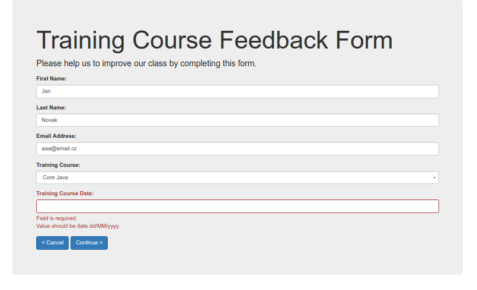

# Three page Spring MVC Wizard
* Hibernate
* Spring MVC
* Bootstrap
* some Java 8

###### Not solved
* HTML Templates
* Session timeout handling / expiration
* Localization
* views to WEB-INF
* more tests (DAO, validator ...)

###### Tested on
* Chromium Browser Version 53.0.2785.143

###### Screenshot

###### Start
`mvn jetty:run`
